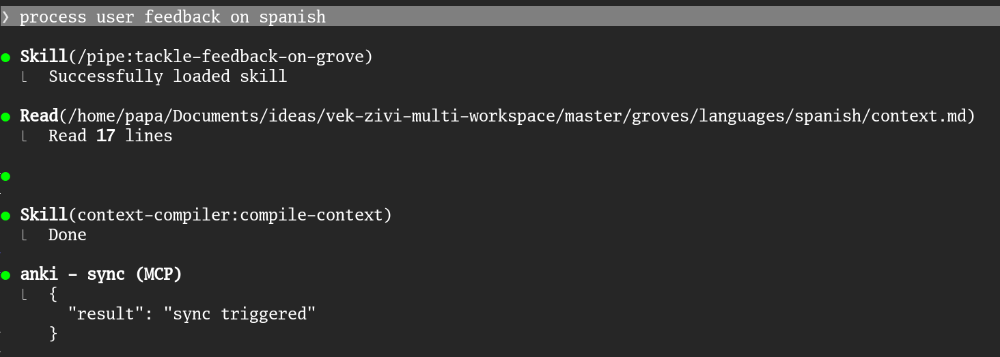
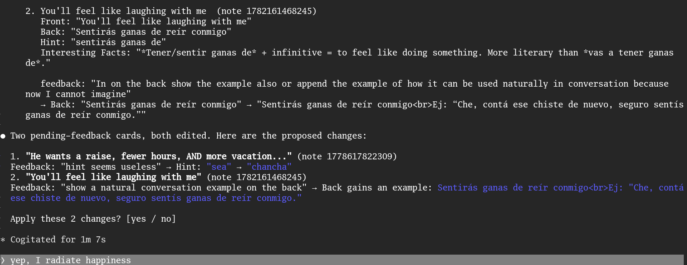
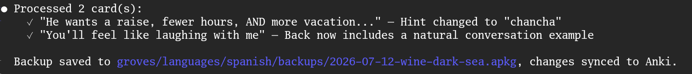

# Anki MCP Subsystem

Self-contained MCP server that exposes Anki operations as native Claude tools.
Claude calls tools directly instead of constructing JSON strings and invoking bash.


---

## Package layout

```
plugins/anki-mcp/
├── .claude-plugin/
│   └── plugin.json         Plugin manifest — exposes skills/ as anki-mcp:<name>
├── skills/
│   └── process-user-feedback-on-deck/  User-invocable — orchestrates the feedback loop
│       ├── extract.py                  CLI — finds pending feedback, writes edit-input file
│       ├── edit.py                     CLI — drives a claude -p edit, writes edit-output file
│       ├── confirm.py                  CLI — prints the proposed diff for user approval
│       └── apply.py                    CLI — applies confirmed edits, clears user_feedback
├── server.py       Entry point — sets sys.path, imports core + tools, runs mcp
├── launcher.py     Anki process lifecycle (ensure_anki_running)
├── core.py         Shared state: mcp instance, _call(), FLAGS, _log
├── managed_note_types/
│   ├── bootstrap.py    Startup: ensures configured note types exist + carry managed fields
│   ├── feedback.py     extract_feedback_records — pulls pending user_feedback, sets RED flag
│   └── tools/
│       └── edits.py    update_note_fields(_batch) — diff-aware, log-appending override
└── tools/
    ├── __init__.py     Imports all submodules → triggers @mcp.tool() registration
    ├── cards.py        Card search, metadata, flag ops
    ├── notes.py        Note create/update/delete
    ├── tags.py         Tag operations (note-level)
    ├── decks.py        Deck management + sync
    ├── scheduling.py   Suspend, forget, relearn, answer, intervals
    ├── models.py       Note type introspection
    ├── media.py        Media store/retrieve/delete
    ├── stats.py        Review history and collection stats
    ├── aggregate.py    Higher-level aggregation (get_all_notes, get_flagged_notes)
    └── analytics.py    Computed metrics (vocabulary_snapshot, learning_velocity)
```

**Adding a tool:** add a `@mcp.tool()` function to the appropriate `tools/*.py` file.
Import `mcp` and `_call` from `core`. Restart Claude Code after any server change.

---

## Tools

Exposes effectively the full AnkiConnect surface — search, note/card CRUD, tags, flags,
decks, scheduling, models, media, stats — as native tools instead of JSON strings over
bash. That part is table stakes; one file per category, listed below with no per-tool
detail (signatures are self-documenting, see the source). The value-add is what's built
on top: **aggregation/analytics** (collapsing multi-step roundtrips) and **managed note
types** (a feedback pipeline with change history) — both covered in full below.

### Base surface (mirrors AnkiConnect 1:1)

| Category | File | Tools |
|---|---|---|
| Search | `cards.py` | `find_cards`, `find_flagged_cards`, `find_notes` |
| Card & note metadata | `cards.py`, `notes.py` | `cards_info`, `notes_info`, `cards_to_notes` |
| Note mutations | `notes.py` | `add_notes`, `can_add_notes`, `update_note`, `update_note_model`, `delete_notes`, `remove_empty_notes` |
| Tags | `tags.py` | `get_tags`, `add_tags`, `remove_tags`, `update_note_tags`, `clear_unused_tags`, `replace_tags_in_all_notes` |
| Flags | `cards.py` | `set_card_flag` |
| Decks | `decks.py` | `deck_names`, `deck_stats`, `get_decks`, `create_deck`, `get_deck_config`, `save_deck_config`, `change_deck`, `delete_decks`, `export_deck`, `import_package`, `sync` |
| Scheduling | `scheduling.py` | `are_suspended`, `are_due`, `get_intervals`, `suspend_cards`, `unsuspend_cards`, `forget_cards`, `relearn_cards`, `answer_cards` |
| Models | `models.py` | `model_names`, `model_field_names`, `model_templates`, `model_styling`, `rename_model_field`, `add_model_field`, `remove_model_field`, `change_note_type`, `update_model_templates`, `update_model_styling`, `create_model` |
| Media | `media.py` | `store_media_file`, `retrieve_media_file`, `get_media_files_names`, `get_media_dir_path`, `delete_media_file` |
| Statistics | `stats.py` | `get_collection_stats`, `card_reviews`, `get_reviews_of_cards`, `get_latest_review_id` |

One resource is served alongside these: `anki://template-reference` (card template
syntax and CSS conventions — read before calling `update_model_templates` or
`update_model_styling`). Access via `ListMcpResourcesTool` / `ReadMcpResourceTool`.

### Aggregation & analytics — collapse multi-step roundtrips

| Tool | What |
|---|---|
| `get_all_notes(deck, include_scheduling?)` | All notes in a deck, fields flattened. Foundation for bulk AI operations. |
| `get_flagged_notes(deck, flag)` | Flagged notes merged and ready for editing — card_id + flattened fields in one call. |
| `vocabulary_snapshot(deck)` | Maturity breakdown + weighted vocabulary estimate + sample words. |
| `learning_velocity(deck, days?)` | Learning rate + 30-day and 365-day projections. |

### Managed note types — the feedback pipeline

Note types declared in a project config (`--managed-config <path>` at startup, see
`.mcp.json`) automatically carry two extra fields, injected by
`managed_note_types/bootstrap.py` on first tool use (lazy, idempotent, safe every
startup):

- `user_feedback` — free-text edit instruction the user writes directly on a card in
  Anki. User-authored only; the server only ever clears it, never sets it.
- `log` — append-only JSON history of every diffed field change.

Config shape (`groves/managed-models.json` in the monorepo):
```json
{
  "managed_note_types": [
    {"name": "Production", "fields": ["Front", "Back", "Hint", "Interesting Facts"], "is_cloze": false}
  ]
}
```

**The loop:** user writes an instruction into `user_feedback` in Anki →
`extract.py` finds it, flags the card RED, writes an edit-ready record to a static
file → an LLM turns the instruction into field edits → `apply.py` diffs, writes only
what changed, appends to `log`, clears `user_feedback`, flips the flag RED → GREEN.
Orchestrated end-to-end by the `process-user-feedback-on-deck` skill (see Skills
below).

`extract_feedback_records` and `update_note_fields_batch` are **not MCP tools** —
each has exactly one caller (the skill's CLI scripts), so they're plain functions
kept off the always-loaded tool list. `update_note_fields` stays a tool since it's
useful ad hoc, outside the pipeline.

| Tool | What |
|---|---|
| `update_note_fields(note_id, new_fields)` | Overrides the plain version for managed notes: diffs against current values, writes + logs only what changed, clears `user_feedback` flips RED → GREEN. Plain behavior for non-managed notes. |

---

## Skills

Shipped as a Claude Code plugin (`.claude-plugin/plugin.json`) — when this repo is
checked out at `plugins/anki-mcp`, its skills load namespaced as `anki-mcp:<name>`.

| Skill | Invocation | What |
|---|---|---|
| `process-user-feedback-on-deck` | user-invocable | Orchestrates the feedback loop above end-to-end: extract.py → edit.py (drives a `claude -p` edit) → confirm.py → apply.py. Used by the monorepo's `/pipe:anki-process-flags` pipeline. |

---

## Example: feedback loop in action

A one-line request — `process user feedback on spanish` — is enough to trigger the whole
loop. No grove path, no deck name, no pipeline invocation spelled out:

```
> process user feedback on spanish
```

That plain sentence resolves through `/pipe:tackle-feedback-on-grove`: read the grove's
`context.md` to find its deck spec, compile it, sync Anki, fuzzy-match the deck name
(`Español`), back it up, then extract every card carrying pending `user_feedback`:



This run turned up two cards. `confirm.py` prints each one's instruction next to its
before/after diff before anything touches the collection — a hint field feedback called
"useless" gets swapped for a more relevant one, and a translation gains a natural,
in-context example sentence on request:

```
1. "He wants a raise, fewer hours, AND more vacation..." (note 1778617822309)
   Feedback: "hint seems useless" → Hint: "sea" → "chancha"
2. "You'll feel like laughing with me" (note 1782161468245)
   Feedback: "show a natural conversation example on the back" → Back gains an example: …
```

The approval gate doesn't require a literal "yes" — ordinary conversational assent works
just as well:



Both edits get applied, the pipeline re-syncs, and the run reports exactly what changed
and where the backup landed:



The result, rendered live in Anki — the "You'll feel like laughing with me" card, back
now carrying the requested example, flag cleared:


---

## Prompts

Prompts are user-triggered templates that load live Anki data into the conversation as context.
Invoke them via the slash menu in Claude Code as `/mcp__anki__<name>`.

| Prompt | Args | What |
|---|---|---|
| `deck_briefing` | `deck` | Vocabulary breakdown, learning velocity, and all pending flags for a deck. |

---

## Setup

**Create the venv and install the MCP SDK (one-time):**
```
python3 -m venv <this anki-mcp directory>/.venv
<this anki-mcp directory>/.venv/bin/pip install mcp
```

The venv is gitignored — run after cloning or on a fresh machine.

**Restart Claude Code** after any changes to `.mcp.json` or the server — it is spawned at startup.

---

## Stdio discipline

Stdout is the JSON-RPC protocol channel.
- Never `print()` outside the SDK — it corrupts the stream silently
- All debug/log output goes to `anki-mcp.log` via `core._log`

---

## AnkiConnect reference

https://git.sr.ht/~foosoft/anki-connect
